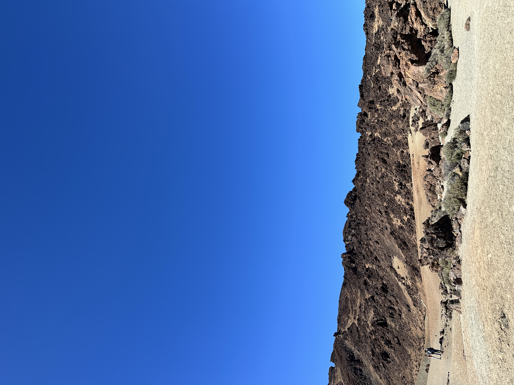

  <em>Mobile Engineer · Flutter Developer · Cross-platform & Native</em>

  

<!-- --- -->

<!-- About me — fill later -->

---

### Stack

**Mobile**  

**Backend & Cloud**  

**Other**  

**Tools**  

---

### Contact

---

🇻🇪 Spanish &nbsp;·&nbsp; 🇺🇸 English
